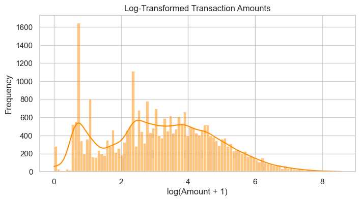
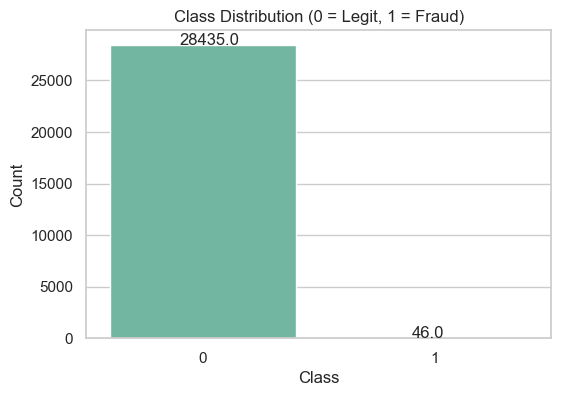
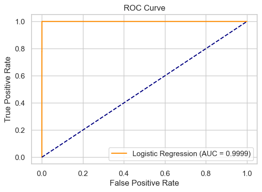
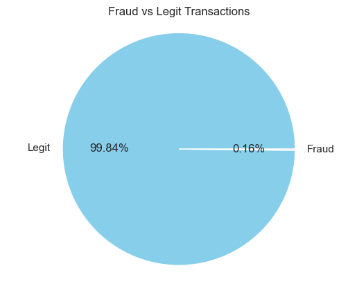
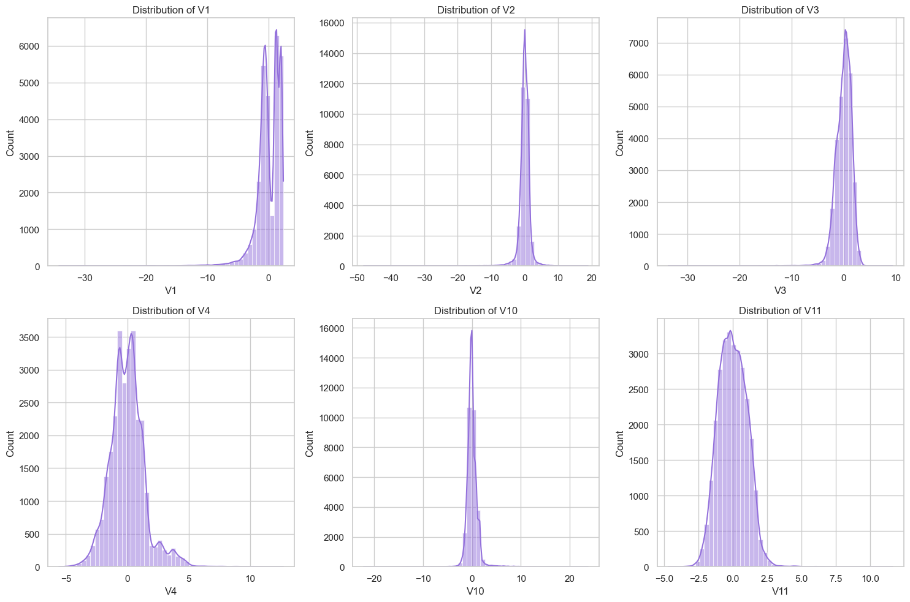

# 💳 Credit Card Fraud Detection

A machine learning project that detects fraudulent credit card transactions from a highly imbalanced dataset. The focus is less on raw accuracy and more on correctly framing an imbalanced classification problem — using recall, precision, and ROC-AUC as the metrics that actually matter when fraud cases are extremely rare.

## Problem

In real-world transaction data, fraud is a tiny minority class. In this dataset, only **46 out of 28,481 transactions (0.16%)** are fraudulent. A model that simply predicts "not fraud" every time would already be 99.8% "accurate" while being completely useless — so the project explicitly works around this imbalance rather than optimizing for accuracy alone.

<p align="center">
  
  
</p>

## Dataset

- 28,481 transactions, 31 features
- `Time`: seconds elapsed since the first transaction
- `Amount`: transaction amount
- `V1`–`V28`: anonymized/PCA-transformed features (original features are not disclosed for confidentiality, as is standard for this well-known Kaggle-style credit card fraud dataset)
- `Class`: target label (0 = legitimate, 1 = fraud)
- No missing values in any column

## Approach

1. **Exploratory Data Analysis** — class distribution, transaction amount and time distributions (raw and log-transformed), boxplots of amount by class, and density comparisons of transaction timing between fraud and legitimate transactions.
2. **Preprocessing** — features scaled with `StandardScaler`; an 80/20 stratified train/test split preserves the fraud/legit ratio in both sets.
3. **Modeling** — Logistic Regression with `class_weight='balanced'` to counteract the severe class imbalance without needing external resampling (e.g. SMOTE).
4. **Evaluation** — accuracy, confusion matrix, full classification report (precision/recall/F1 per class), and ROC-AUC, since accuracy alone is misleading on imbalanced data.

## Exploratory Data Analysis

Fraudulent and legitimate transactions differ noticeably in amount and timing. Fraud amounts skew toward smaller, more tightly clustered values, and fraud shows a different density pattern across the transaction time window than legitimate activity — signal the model picks up on alongside the anonymized `V1`–`V28` features.

<p align="center">
  
  
</p>

## Results

| Metric | Score |
|---|---|
| Accuracy | 98.44% |
| Recall (fraud class) | 100% — every fraudulent transaction in the test set was caught |
| Precision (fraud class) | 9.18% |
| ROC-AUC | 0.9999 |

The model was tuned to prioritize **recall on the fraud class**: it catches every actual fraud case in the test set (9/9), at the cost of also flagging a number of legitimate transactions as suspicious (89 false positives out of 5,688 legit transactions). This is a deliberate, realistic trade-off for fraud detection — missing a real fraud is typically far more costly than a false alarm that gets reviewed and cleared. The near-perfect ROC-AUC score shows the model separates the two classes very well overall, independent of the specific decision threshold used.

<p align="center">
  
  
</p>

## Tech Stack

- Python
- pandas, NumPy
- scikit-learn (Logistic Regression, preprocessing, metrics)
- matplotlib, seaborn (visualization)

## Repository Contents

| File | Description |
|---|---|
| `credit_card.ipynb` | Full notebook: EDA, preprocessing, model training, and evaluation |
| `images/` | Plots referenced in this README, extracted from the notebook |
| `README.md` | Project documentation |

> Note: `credit_data.csv` (the dataset) is not included in this repo — add it to the project root before running the notebook.

## Getting Started

1. Clone the repository:
   ```bash
   git clone https://github.com/NaveenK9959/Credit-card-Fraud-Detection.git
   cd Credit-card-Fraud-Detection
   ```
2. Install dependencies:
   ```bash
   pip install numpy pandas matplotlib seaborn scikit-learn jupyter
   ```
3. Place `credit_data.csv` in the project root.
4. Launch the notebook:
   ```bash
   jupyter notebook credit_card.ipynb
   ```

## Possible Extensions

- Compare against tree-based models (Random Forest, XGBoost) and ensemble methods
- Try resampling techniques (SMOTE, undersampling) alongside class weighting
- Precision-recall curve and threshold tuning, since ROC-AUC can look overly optimistic on highly imbalanced data
- Cost-sensitive evaluation that weighs false negatives vs. false positives explicitly.
